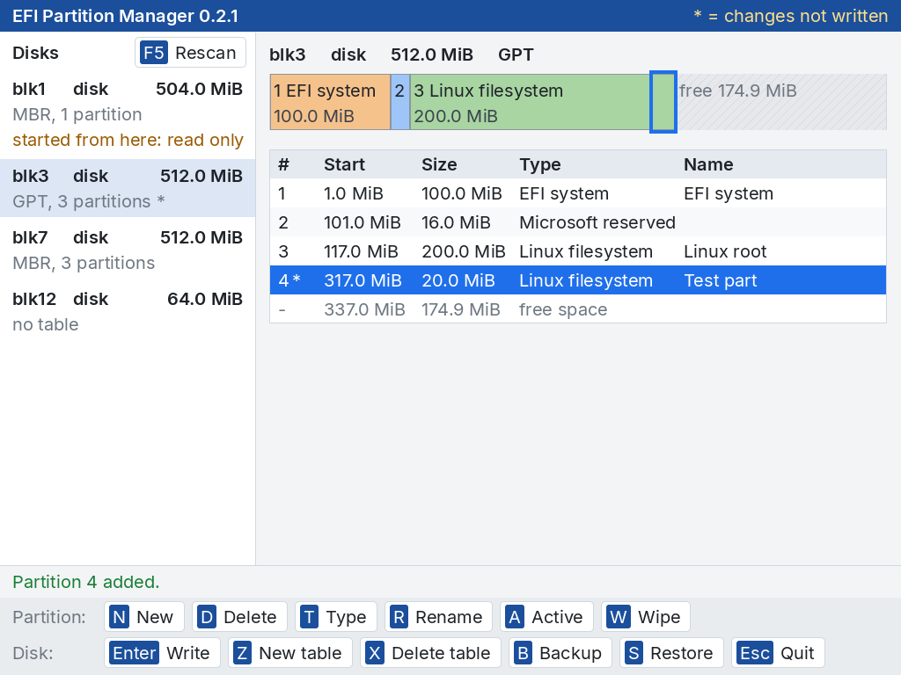

# EFI Partition Manager

[](https://github.com/nic-fio/EFI_PARTITION_MANAGER/actions/workflows/ci.yml)
[](LICENSE)
[Documentation](https://nic-fio.github.io/EFI_PARTITION_MANAGER/) · [Download](https://github.com/nic-fio/EFI_PARTITION_MANAGER/releases/latest)

A partition manager for UEFI firmware, with a window used with the mouse or
the keyboard. One file, `partmgr.efi`: start it from the firmware boot menu or
from a UEFI shell, and prepare disks before any operating system is there.



> **Status.** partmgr is new. It is tested automatically in QEMU with OVMF
> firmware and on disk images checked by `sfdisk` and `parted`, but it has not
> been tried on real hardware yet. Until it has, use it on disks whose contents
> you can afford to lose, and make a backup (key **B**) first.
> [Reports](https://github.com/nic-fio/EFI_PARTITION_MANAGER/issues/new?template=hardware-report.yml)
> are very welcome.

## Highlights

- **A window and the mouse**: a graphical window at the screen's own
  resolution, with sharp text from 640 × 480 up (tried up to 3200 × 1800),
  used with the mouse or the keyboard. partmgr drives a USB mouse itself when
  the firmware cannot; where there is no graphics screen, text screens do the
  same.
- **GPT and MBR**, read and written in full: MBR with primary, extended and
  logical partitions; GPT with both copies checked and, when written, repaired.
- **See first, write later**: every change is shown on the screen, marked with
  a star, and the disk changes only on **Write**, after a red warning confirmed
  with **Y** or **Yes**.
- **Backup and restore** of the partition table to a small file, restored
  byte for byte.
- **Wipe** a partition: random data, then zeros, with a progress bar, the speed
  and the time left.
- **Readable**: partition types chosen from a list, sizes such as `512M`,
  `1.5G` or `rest`, notes that explain damaged or unusual tables.
- **Safe by design**: the disk partmgr was started from is never written.
- **No EDK2 code**: written from scratch, with its own UEFI definitions, runtime
  and build tools.

## Documentation

| Document | For |
|---|---|
| [User manual](https://nic-fio.github.io/EFI_PARTITION_MANAGER/partmgr-user-manual.html) | Using partmgr: the screens, every key, backups, wipe, the notes about damaged tables. |
| [Technical manual](https://nic-fio.github.io/EFI_PARTITION_MANAGER/partmgr-developer-manual.html) | How partmgr reads, changes and writes tables, the backup format, the tests, how to extend it. |
| [Design decisions and history](docs/decisions-and-history.md) | Why partmgr is the way it is. |

## Build and test

```
git clone https://github.com/nic-fio/EFI_PARTITION_MANAGER.git
cd EFI_PARTITION_MANAGER
tools/setup-dev.sh --install    # packages (asks for sudo) and the git identity
make && make test && make qemu-test
```

```
make             # build/partmgr.efi (UEFI x86-64)
make test        # the partition table tests on Linux, the documentation check
make qemu-test   # partmgr.efi inside QEMU/OVMF on test disks
make docs        # the line counts of the technical manual
```

`OVMF=/path/to/OVMF.fd` selects the firmware image. [CLAUDE.md](CLAUDE.md) says how
the project is worked on.

## Install

Copy `partmgr.efi` to a FAT-formatted USB stick:

- as `\EFI\BOOT\BOOTX64.EFI`, and choose the stick in the firmware boot menu;
- or next to a UEFI shell, and start it from the shell's prompt.

With Secure Boot active, sign it with a key the machine trusts first (see the
user manual).

To try it in QEMU with OVMF, give the virtual machine a USB mouse: QEMU's
default PS/2 mouse is not seen, and there is no pointer without one.

```
qemu-system-x86_64 -machine q35 -accel kvm -bios OVMF.fd -device qemu-xhci -device usb-mouse \
  -drive if=virtio,format=raw,readonly=on,file=fat:esp    # esp/EFI/BOOT/BOOTX64.EFI is partmgr.efi
```

## Licence

Copyright (c) 2026 nic-fio. EFI Partition Manager is released under the
**Apache License 2.0 with the [Commons Clause](LICENSE)**: use it for anything,
at home or at work, free of charge; copy it, modify it and share it, keeping the
notices and saying what you changed. What you may not do is **sell** it, or sell
a product or service whose value comes substantially from it — that needs a
commercial licence ([open an issue](https://github.com/nic-fio/EFI_PARTITION_MANAGER/issues)
to ask for one).

The Commons Clause means the project is not "open source" by the OSI
definition. Third-party components keep their own licences, listed in
[NOTICE.md](NOTICE.md).
